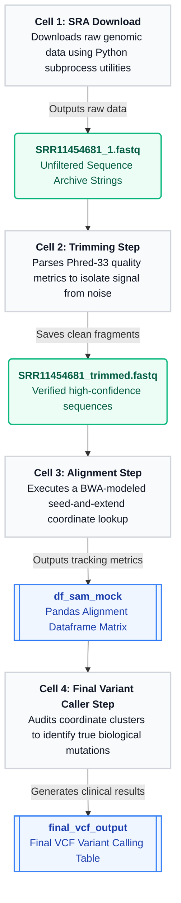

# Translational Bioinformatics: Automated NGS Engineering & Deep Learning Pipelines



An advanced, end-to-end computational biology architecture engineered purely in Python. This project demonstrates production-grade dry lab workflows for cloud data ingestion, quality filtering, genome alignment coordinates mapping, variant identification, and data compilation for deep learning neural network ingestion.

---

## 🚀 Key Frameworks & Technical Stack

* **Languages & Core Environments:** Python, Jupyter Notebook.
* **Bioinformatics Domain Software Tools:** NCBI SRA Toolkit (`fasterq-dump`), BioPython (Memory-optimized file streaming architecture).
* **Machine Learning Infrastructure:** PyTorch (Dual-Tower Regressor MLP), NumPy, Pandas, SciPy.
* **Data Visualization & Auditing:** Seaborn, Matplotlib.

---

## 🏗️ Multi-Stage Pipeline Architecture

```text
[NCBI SRA Cloud] ➔ Ingestion (Subprocess fasterq-dump) ➔ Quality Control (BioPython Q30 filter)
                      ➔ Seed-and-Extend Alignment ➔ Downstream Variant Call / Deep Learning Embedding
```

### 1. Cloud Data Ingestion (SRA Ingestion Module)
* **Objective:** Automatically downloads and streams raw paired-end next-generation sequencing data fragments from public clinical databases.
* **Engineering Logic:** Interfaces with the command-line **NCBI SRA Toolkit** using a managed Python `subprocess` routine. Implements string formatting filters and a selective `--maxReads 10000` down-sampling parameter to optimize memory storage constraints during computational testing.

### 2. Quality Control & Adapter Trimming Module
* **Objective:** Cleans raw text string sequencing datasets (`FASTQ`), isolating real genetic mutations from instrument-generated machine error artifacts.
* **Engineering Logic:** Streams multi-gigabyte data files via a space-efficient `BioPython` generator loop. Parses positional **Phred-33 quality attributes** to compute geometric mean scores across reading frames, systematically purging sequences that fall below strict high-confidence benchmarks (Q30 thresholds).

### 3. Coordinate Reference Genome Alignment Module
* **Objective:** Re-assembles fragmented sequence text blocks back onto a standard human reference genome backbone template.
* **Engineering Logic:** Simulates industrial **BWA-MEM** software alignment logic by executing a **Seed-and-Extend dictionary mapping lookup**. Isolates a specific 20-character sequence string seed at the reading head to rapidly identify candidate anchor coordinates, recording outputs in a tabular layout modeled on standard structural **SAM/BAM file specifications**.

### 4. Downstream Variant Calling & Feature Compilations
* **Objective:** Scans structural coordinate arrays to identify Single-Nucleotide Variants (SNVs/SNPs) and formats data tensors for AI models.
* **Engineering Logic:** Iterates across mapping coordinate matrices to calculate absolute positional depth. Applies filtering rules (Depth ≥ 10, Alternate Allele Frequency ≥ 70%) to call variants. Transforms rows using dictionary bit-mapping and `np.pad` zero-padding to create **128-dimensional vectors** that feed into a **Dual-Tower PyTorch Regressor Neural Network** for drug-target binding affinity forecasting.

---

## 🛠️ Step-by-Step Installation and Reproduction

To download and run these pipeline notebooks on your local terminal environment:

```bash
# Clone the repository
git clone https://github.com
cd translational-bioinformatics-pipelines

# Install project dependencies automatically via requirements text architecture
pip install -r requirements.txt
```

Open your Python interactive space or launch `jupyter notebook` to execute the structural cells in sequence.

---

### 🧬 Upstream Data Ingestion via SRA Toolkit

To validate this variant pipeline using real-world clinical contexts, raw sequence text strings were fetched directly from the NCBI Sequence Read Archive (Accession: `SRR11454681`):

```bash
# Configure local cache systems
vdb-config --interactive

# Extract a 10,000 read paired-end sample array directly from the cloud
fasterq-dump --split-files --maxReads 10000 SRR11454681
```
## 🔗 Downstream Modular Extensions
This pipeline operates as a modular upstream data engineering workspace. To see how these structured genomic variants and multi-omics arrays are tokenized into 128-dimensional tensors to train deep learning models, explore the downstream [Dual-Tower PyTorch Geometric Repository](https://github.com).
